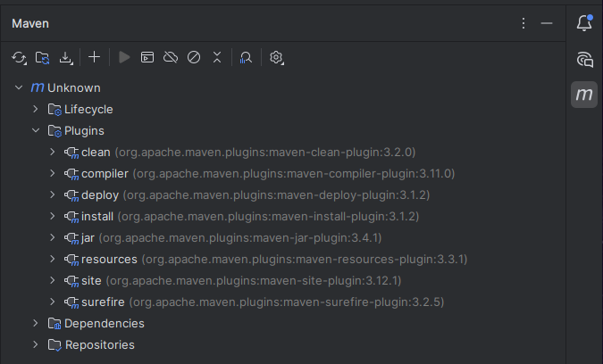

# How to show maven plugins

### How can all of a project's plugins be displayed?

There are a lot of alternative methods to do that by `cli`, such as reading the `pom.xml` or using commands like:

```shell
mvn help:effective-pom | grep -E "<plugin>|<artifactId>|<version>"
```

that will list all the plugins from inside of the `pom.xml`

### There are an extra way if you are using JetBrains Intellij

If you want all the plugins to be displayed, you can easily go to the maven icon in the top right of the `IDE` and open the `Plugins` file

